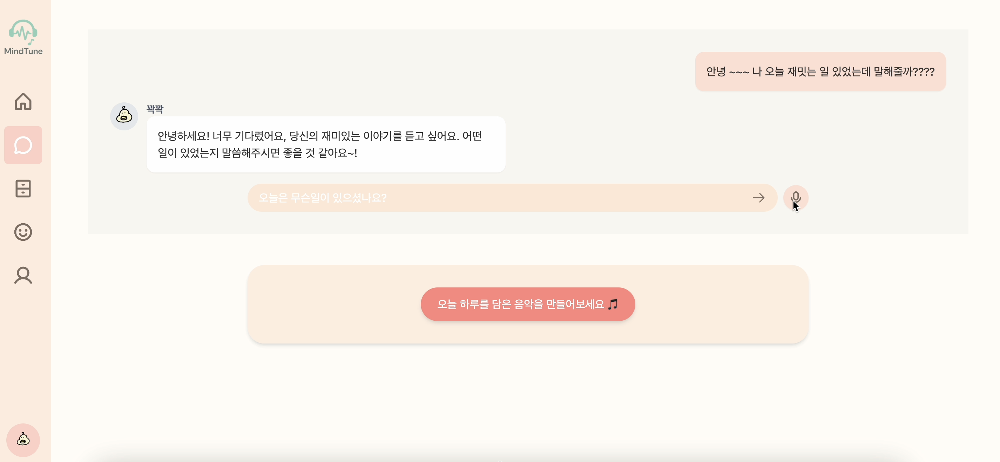

## 2025-1-OSSProj-skycastle-03

[Front-end Repository](https://github.com/CSID-DGU/2025-1-OSSProj-skycastle-03-Front.git)

[Back-end Repository](https://github.com/CSID-DGU/2025-1-OSSProj-skycastle-03-Back.git)

### 0. 팀 구성

| 구분 | 성명   | 역할                | 소속학과      | 연계전공        | 이메일 |
|------|--------|---------------------|---------------|-----------------|--------|
| 팀장 | 김하늘 | 프론트엔드, 백엔드 개발 | 통계학과      | 융합소프트웨어   | [lkylky020607@gmail.com](mailto:lkylky020607@gmail.com) |
| 팀원 | 김희진 | 프론트엔드 개발        | 경영정보학과   | 융합소프트웨어   | [kimheejin@dgu.ac.kr](mailto:kimheejin@dgu.ac.kr) |
| 팀원 | 양윤규 | 백엔드 개발           | 통계학과      | 데이터사이언스   | [yykyyk0913@naver.com](mailto:yykyyk0913@naver.com) |
| 팀원 | 황서영 | 백엔드 개발           | 통계학과      | 융합소프트웨어   | [hsy5275@naver.com](mailto:hsy5275@naver.com) |

### 1. 개발 목표

- 음성 및 텍스트 기반 AI 상담 제공  
- 감정 분석을 통한 맞춤형 음악 생성 및 감정 케어

### 2. 설계 및 구현

**2-1) 전체 아키텍처**
- Front-end : Vite + React 기반 SPA, TypeScript, Tailwind CSS, Axios
- Back-end : Spring Boot, JWT 인증, AI 모델 연동 (Python)
- DataBase : MySQL (AWS RDS)
- Deployment : Docker + AWS EC2  

- 유스케이스 다이어그램

- 시스템 블록 다이어그램

- 시스템 개념도

- 시스템 모듈 도식

**2-2) DB 설계**

- 데이터베이스 저장 정보

- ERD

**2-3) 주요 기능 흐름**
- 메인 플로우차트  

- 시퀀스 다이어그램

### 3. 서비스 구현 결과
- 시작    

- 상담    

  
  

텍스트 및 음성 상담, 음악 스타일 지정 (EXPRESSIVE / COUNTER)

- 캘린더    

캐릭터 달력 마크 및 이달의 음악 생성 / 재생

- 캘린더 디테일  

  
  

날짜 클릭시 해당 일자의 상담 및 음악 확인

### 4. 기대효과

**4-1) 심리 건강 증진**
- 감정 기반 음악 제공으로 정서 안정 및 스트레스 완화  
- 감정 기록 기능을 통한 자기 이해 증진  

**4-2) 기술적 혁신**
- 감정 분석, 챗봇, 음악 생성 AI 융합  
- NLP, 음성 인식 등 첨단 기술 적용  

**4-3) 응용 및 확장성**
- 교육, 의료, 복지 등 다양한 분야로 확장 가능  
- 전문가 보조 도구로 활용 가능  

**4-4) 파급 효과**
- 정신 건강 예방 및 의료비 절감 기대  
- 관련 산업 및 콘텐츠 시장 활성화 기여

### 5. 실행 방법

- http://52.78.42.91/ 접속

### 6. 자료 관리

**제안발표**

[수행계획서](./Doc/1_1_OSSProj_03_SkyCastle_수행계획서_v1.pdf)  
[발표자료](./Doc/1_2_OSSProj_03_SkyCastle_수행계획발표자료.pdf)  
[회의록](./Doc/1_3_OSSProj_03_SkyCastle_회의록.pdf)

**중간발표**

[중간보고서](./Doc/2_1_OSSProj_03_SkyCastle_중간보고서.pdf)  
[발표자료](./Doc/2_2_OSSProj_03_SkyCastle_중간발표자료.pdf)  
[회의록](./Doc/2_3_OSSProj_03_SkyCastle_회의록.pdf)

**최종발표**

[최종보고서](./Doc/3_1_OSSProj_03_SkyCastle_최종보고서.pdf.pdf)  
[발표자료](./Doc/3_2_OSSProj_03_SkyCastle_최종발표자료.pdf)  
[회의록](./Doc/3_3_OSSProj_03_SkyCastle_회의록.pdf)  
[제품구성배포운영자료](./Doc/3_4_OSSProj_03_SkyCastle_제품구성배포운영자료.pdf)  
[시연영상](https://youtu.be/SGw4PQ_0HFk)  

### 7. 이슈 관리
[이슈관리](https://www.notion.so/1ef191254fee80f3ad83d5e3e0ac92ad?pvs=4)